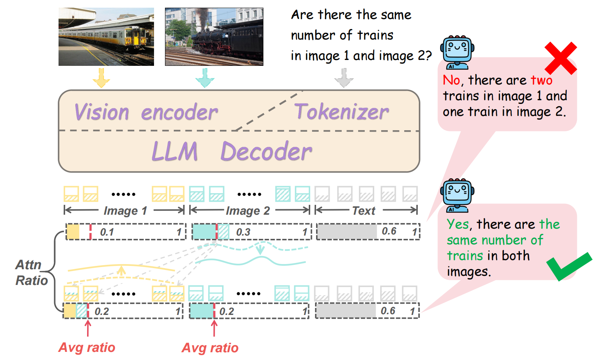

# MIHBench&DAB: MIHBench: Benchmarking and Mitigating Multi-Image Hallucinations in Multimodal Large Language Models


This is the official repo for Dynamic Attention Balancing (DAB), a lightweight, training-free approach for reducing multi-image hallucinations in Multimodal Large Language Models (MLLMs) during decoding, without introducing additional inference overhead.

<div style='display:flex; gap: 0.25rem; '>
<a href='https://arxiv.org/abs/2508.00726'></a>
</div>

## 🔍 Method Overview

<p align="center">  </p>

We introduce **Dynamic Attention Balancing (DAB)**, a simple and training-free method that adaptively redistributes attention across multiple image inputs during decoding. The core of DAB involves the following steps:

### 1. Attention Ratio Calculation  
The attention ratio for each image $k$ is calculated as:

```math
\text{ratio}_k = \sum_{i=1}^{N_{I_k}} a_{i,j}^{l,h}, \quad \text{for } i = 1,\dots,N_{I_k}; \quad j = 1,\dots,N_X
```

where:

- $a_{i,j}^{l,h}$ represents the attention weight from the $i$-th image token to the $j$-th text token in the $l$-th layer and $h$-th head.
- $N_{I_k}$ denotes the number of image tokens in the $k$-th image.
- $N_X$ represents the number of text tokens.

This ratio is computed over all image tokens in the $k$-th image and all text tokens in the sequence.

### 2. Average Attention Ratio  
The average attention ratio across all images is computed as:

```math
\text{avg\_ratio} = \frac{1}{n} \sum_{k=1}^{n} \text{ratio}_k
```

where $n$ is the total number of images, and only those valid visual-related attention heads with $\sum_{k=1}^{n} \text{ratio}_k > 0.2$ are considered for balancing.

### 3. Attention Shift Calculation  
The attention shift for each image is calculated as:

```math
\Delta_{k,j}^{l,h} = \text{avg\_ratio} - \text{ratio}_k
```

where $\Delta_{k,j}^{l,h}$ represents the adjustment made to the attention weight for the $k$-th image's tokens.

### 4. Adjusted Attention Weight  
Finally, the adjusted attention weight is:

```math
\tilde{a}_{i,j}^{l,h} = a_{i,j}^{l,h} + \alpha \cdot \frac{\Delta_{k,j}^{l,h}}{N_{I_k}}
```

where $\alpha$ is a balancing coefficient that controls the intensity of the adjustment.

By ensuring a more balanced attention allocation across all input images, DAB effectively mitigates over-reliance on individual image tokens, reducing multi-image hallucinations and improving semantic integration in multi-image reasoning tasks.


## 📊 MIHBench

The specific question files for MIHBench are provided in the "Questions" folder.

The Existence and Count tasks use images from the MSCOCO2014 validation set.

The Id Consistency task uses images from a subset of CO3D, which can be downloaded [here](https://drive.google.com/drive/folders/1aiI109w3wXUDUxPOAdd_eY-WKnkgK6Vg?usp=sharing).


## 🚀 How to Use in MLLM (Example with Qwen2.5-VL)

For Qwen2.5-VL, we are using transformers version 4.51.3.
You can refer to the content marked with `###OURS###` in our `qwen2.5vl_eval.py` and `modeling_qwen2_5_vl.py` files.

1. **Obtain the Start Positions and Counts of Image Tokens in the Model-Processed Token Sequences**
   As in `qwen2.5vl_eval.py`, the following code extracts the starting position and count of image tokens:

   ```python
   num_image_token = (inputs['input_ids'][0] == 151655).sum().item()
   img_str_idx = (inputs['input_ids'][0] == 151652).nonzero(as_tuple=True)[0].tolist()  
   per_img_token = num_image_token / num_images
   img_str_idx.append(per_img_token)  
   ```

2. **Introduce Relevant Hyperparameters `img_str_idx`, `alpha`, `base_ratio` into Model Inference**
   As in `qwen2.5vl_eval.py`, modify the inference function as follows:

   ```python
   generated_ids = model.generate(
               **inputs, 
               max_new_tokens=128,
               img_str_idx=img_str_idx,
               alpha=args.alpha,
               base_ratio=args.base_ratio,
               )  
   ```

3. **Recursively Add Parameters in the Model's `forward()` Function**
   As in `modeling_qwen2_5_vl.py`, modify the `forward()` function to include these parameters:

   ```python
   def forward(
           self,
           input_ids: Optional[torch.LongTensor] = None,
           attention_mask: Optional[torch.Tensor] = None,
           position_ids: Optional[torch.LongTensor] = None,
           past_key_values: Optional[List[torch.FloatTensor]] = None,
           inputs_embeds: Optional[torch.FloatTensor] = None,
           labels: Optional[torch.LongTensor] = None,
           use_cache: Optional[bool] = None,
           output_attentions: Optional[bool] = None,
           output_hidden_states: Optional[bool] = None,
           return_dict: Optional[bool] = None,
           pixel_values: Optional[torch.Tensor] = None,
           pixel_values_videos: Optional[torch.FloatTensor] = None,
           image_grid_thw: Optional[torch.LongTensor] = None,
           video_grid_thw: Optional[torch.LongTensor] = None,
           rope_deltas: Optional[torch.LongTensor] = None,
           cache_position: Optional[torch.LongTensor] = None,
           second_per_grid_ts: Optional[torch.Tensor] = None,
           ###OURS###
           img_str_idx: Optional[List] = None,
           alpha: Optional[float] = None,
           base_ratio: Optional[float] = None,
           ###OURS###
       ) -> Union[Tuple, Qwen2_5_VLCausalLMOutputWithPast]:
   ```

4. **Modify the Attention Class's `forward()` Function**
   As in `modeling_qwen2_5_vl.py`, modify the `forward()` function of the Attention class as follows:

   ```python
   if alpha != 0:
      attn_weights = reallocation_img_attn_ratio_avg(
          img_str_idx,
          attn_weights,
          base_ratio,
          alpha
      )
   ```

5. **Introduce the `reallocation_img_attn_ratio_avg()` Function**
   As in `modeling_qwen2_5_vl.py`, define the `reallocation_img_attn_ratio_avg()` function:

   ```python
   def reallocation_img_attn_ratio_avg(img_str_idx, attention_map, base_ratio=0.2, alpha=0.5):
       _attention_map = attention_map.clone()
       img_token_num = int(img_str_idx[-1])
       n = len(img_str_idx) - 1
       text_token_str = int(img_str_idx[-1] + img_str_idx[-2])

       img_sums = []
       for i in range(n):
           img_start = int(img_str_idx[i])
           img_end = img_start + img_token_num
           img_sum = _attention_map[0, :, text_token_str:, img_start:img_end].sum(dim=-1)
           img_sums.append(img_sum)
       img_sums = torch.stack(img_sums, dim=0)

       total_ratio = img_sums.sum(dim=0)
       avg_per_img = total_ratio / n

       deltas = img_sums - avg_per_img.unsqueeze(0)
       scale_imgs = deltas * alpha / img_token_num

       mask = total_ratio > base_ratio
       masked_scale_imgs = scale_imgs * mask.unsqueeze(0)

       for i in range(n):
           img_start = img_str_idx[i]
           img_end = img_start + img_token_num
           _attention_map[0, :, text_token_str:, img_start:img_end] -= masked_scale_imgs[i].unsqueeze(-1)

       return _attention_map
   ```


## 📑 Citation
If you find our project useful, we hope you can star our repo and cite our paper as follows:
```
@article{li2025mihbench,
  author = {Li, Jiale and Wu, Mingrui and Jin, Zixiang and Chen, Hao and Ji, Jiayi and Sun, Xiaoshuai and Cao, Liujuan and Ji, Rongrong},
  title = {MIHBench: Benchmarking and Mitigating Multi-Image Hallucinations in Multimodal Large Language Models},
  year = 2025，
  journal = {arXiv preprint arXiv:2508.00726},
  url = {https://arxiv.org/abs/2508.00726}
}
```

## 📝 Related Projects & Acknowledgement
- [Qwen2.5-VL](https://github.com/QwenLM/Qwen2.5-VL): Qwen2.5-VL Technical Report
- [MANTIS](https://github.com/TIGER-AI-Lab/Mantis): MANTIS: Interleaved Multi-Image Instruction Tuning
- [InternVL2.5](https://internvl.github.io/blog/2024-12-05-InternVL-2.5/): Expanding Performance Boundaries of Open-Source Multimodal Models with Model, Data, and Test-Time Scaling
- [LLaVA-NeXT-Interleave](https://github.com/LLaVA-VL/LLaVA-NeXT): LLaVA-NeXT-Interleave: Tackling Multi-image, Video, and 3D in Large Multimodal Models
- [CO3D Dataset](https://ai.meta.com/datasets/co3d-dataset/): Common Objects in 3D: Large-Scale Learning and Evaluation of Real-life 3D Category Reconstruction
- [MSCOCO-2014](https://cocodataset.org/#home): Microsoft COCO: Common Objects in Context


